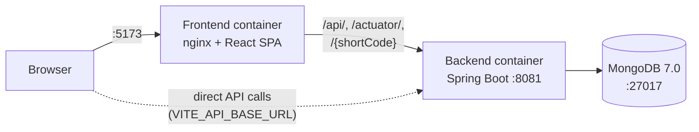
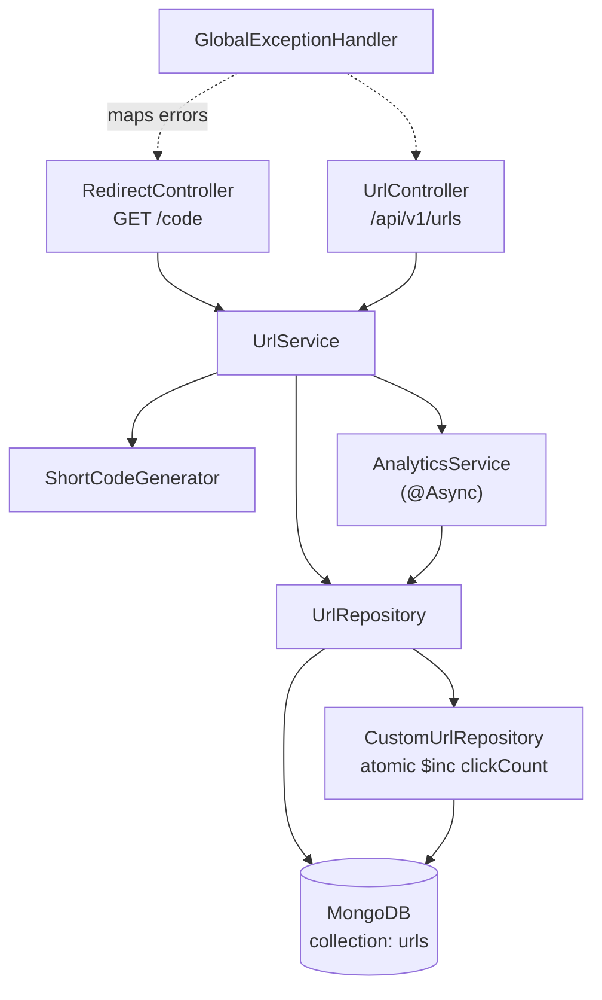
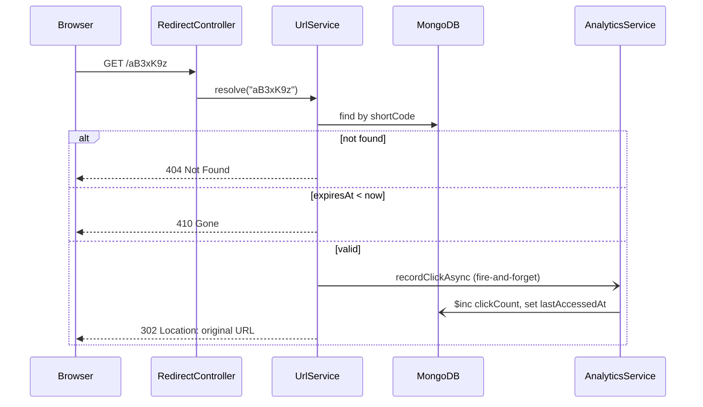
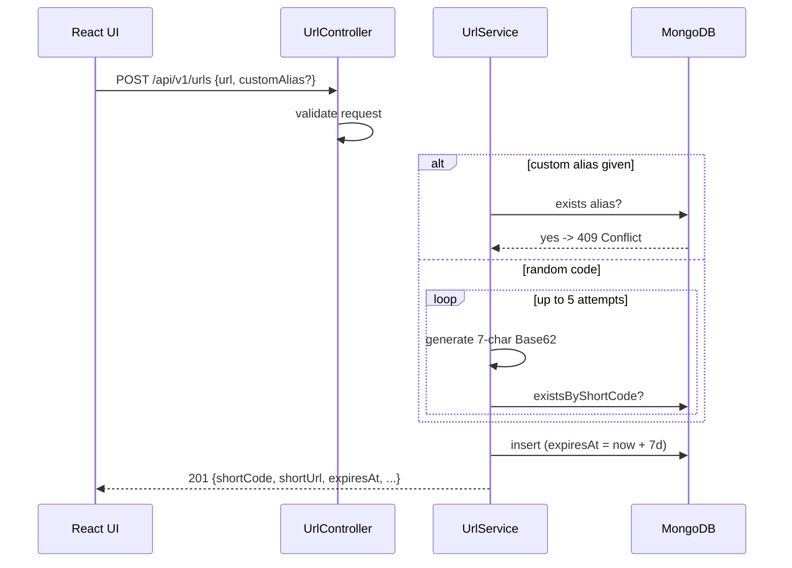

# TinyURL — URL Shortener

A URL shortener built with Spring Boot and React, backed by MongoDB. Paste a long URL, get a short link (optionally with a custom alias), share it, and track clicks. Links expire automatically after 7 days.

## Design Requirements

| # | Requirement |
|---|-------------|
| 1 | Global audience, English |
| 2 | 2 million users |
| 3 | 2% concurrency (~40k concurrent users) |
| 4 | Link TTL of 7 days |

See [`Plan.md`](./Plan.md) for the design doc (capacity math and roadmap). Note that Plan.md is partly aspirational: Redis caching, an API gateway and counter/Snowflake IDs are **not** implemented yet (see [Current limitations](#current-limitations)).

## Features

- **Shorten URLs** — generates a 7-character random Base62 code (`SecureRandom`).
- **Custom aliases** — choose your own code (3–20 chars: letters, digits, `-`, `_`); duplicates return `409 Conflict`.
- **HTTP 302 redirects** — deliberately not 301, so browser caching can't bypass expiry or click counting.
- **7-day expiry** — enforced by a MongoDB TTL index *and* an explicit check at read time (the TTL reaper only runs about once a minute). Expired links return `410 Gone`.
- **Click analytics** — click count, last-accessed time and remaining lifetime; clicks are recorded asynchronously so redirects stay fast.
- **QR codes** — every short link gets a scannable QR code in the UI.
- **Local history** — the UI lists links you've created.
- **Input validation** — http/https/ftp URLs only, max 2048 characters.
- **Health and metrics** — Spring Actuator endpoints.

## Tech Stack

| Layer | Technology | Version |
|-------|-----------|---------|
| Backend language | Java | 21 (virtual threads enabled) |
| Backend framework | Spring Boot (Web, Data MongoDB, Validation, Actuator) | 3.3.4 |
| Build tool | Maven (via `./mvnw`) | 3.9.x |
| Database | MongoDB | 7.0 |
| Frontend | React / React DOM | 19.2 |
| Frontend tooling | Vite, oxlint | 8.2 / 1.79 |
| Frontend libs | `qrcode.react` 4.2, `lucide-react`, `canvas-confetti` | — |
| Frontend runtime image | Node (build) / nginx (serve) | 22-alpine / alpine |
| Containers | Docker + Docker Compose | — |

## Architecture

### System overview (Docker Compose)



The SPA is served by nginx, which also proxies `/api/`, `/actuator/` and short-code paths to the backend. By default the SPA calls the backend directly at `VITE_API_BASE_URL` (`http://localhost:8081`).

### Backend layers (`com.tinyurl`)



| Package | Responsibility |
|---------|----------------|
| `controller` | `RedirectController` (302 redirect), `UrlController` (REST API) |
| `service` | `UrlService` (create/resolve/expire), `ShortCodeGenerator`, `AnalyticsService`, `Base62Encoder` (unused for generation) |
| `repository` | Spring Data repository plus a custom implementation for atomic click increments |
| `model` / `dto` | `UrlMapping` document; request/response objects |
| `config` | CORS, async executor, Mongo index creation (unique `shortCode`, TTL on `expiresAt`) |
| `exception` | Domain exceptions and `GlobalExceptionHandler` |

### Redirect flow



### Create flow



## Project Structure

```
TinyURL/
├── backend/                 # Spring Boot service
│   ├── src/main/java/com/tinyurl/
│   ├── src/main/resources/application.yml
│   ├── src/test/java/       # Unit tests (service + controller)
│   └── Dockerfile
├── frontend/                # React + Vite SPA
│   ├── src/components/      # Form, ResultCard, QrCodeDisplay, AnalyticsView, HistoryList, Header
│   ├── src/services/api.js  # Only API layer
│   ├── nginx.conf
│   └── Dockerfile
├── docker-compose.yml
├── Plan.md                  # Design document
└── ReadME.md
```

## Running Locally

### Prerequisites

- Docker + Docker Compose (for the full stack), **or**
- JDK 21, Node.js 22+ and a MongoDB instance (for running the pieces manually)

### Option 1 — Docker Compose (easiest)

```bash
docker compose up --build
```

| Service | URL |
|---------|-----|
| Frontend | http://localhost:5173 |
| Backend API | http://localhost:8081 |
| MongoDB | localhost:27017 |

Stop with `docker compose down` (add `-v` to also delete the database volume).

### Option 2 — Run each part manually

**1. MongoDB**

```bash
docker run -d --name tinyurl-mongo -p 27017:27017 mongo:7.0
```

**2. Backend** (from `backend/`)

```bash
./mvnw spring-boot:run
```

**3. Frontend** (from `frontend/`)

```bash
npm install
npm run dev        # http://localhost:5173
```

### Tests and builds

```bash
# Backend (from backend/)
./mvnw test                          # all tests
./mvnw test -Dtest=UrlServiceTest    # single class
./mvnw clean package -DskipTests     # build jar

# Frontend (from frontend/) — no test setup; lint and build only
npm run lint
npm run build
```

## Configuration

Backend settings (environment variables, defaults in `application.yml`):

| Variable | Default | Purpose |
|----------|---------|---------|
| `SERVER_PORT` | `8081` | HTTP port |
| `SPRING_DATA_MONGODB_URI` | `mongodb://localhost:27017/tinyurl` | MongoDB connection |
| `APP_BASE_URL` | `http://localhost:8081/` | Prefix used to build the returned `shortUrl` |
| `APP_DEFAULT_TTL_DAYS` | `7` | Link lifetime |
| `ALLOWED_ORIGINS` | `http://localhost:5173,http://localhost:3000,http://127.0.0.1:5173` | CORS origins |
| `SPRING_THREADS_VIRTUAL_ENABLED` | `true` | Java 21 virtual threads |

Frontend: `VITE_API_BASE_URL` (default `http://localhost:8081`). It is a **build-time** variable, so rebuild after changing it.

## API Reference

| Method | Path | Description | Success | Errors |
|--------|------|-------------|---------|--------|
| `POST` | `/api/v1/urls` | Create a short URL | 201 | 400 invalid input, 409 alias taken |
| `GET` | `/api/v1/urls/{code}` | Get link details | 200 | 404, 410 |
| `GET` | `/api/v1/urls/{code}/analytics` | Click count, last access, remaining time | 200 | 404 |
| `GET` | `/{code}` | Redirect to original URL | 302 | 404, 410 |
| `GET` | `/actuator/health` | Health check | 200 | — |

Example:

```bash
curl -X POST http://localhost:8081/api/v1/urls \
  -H 'Content-Type: application/json' \
  -d '{"url": "https://example.com/some/very/long/path", "customAlias": "my-link"}'
```

```json
{
  "shortCode": "my-link",
  "shortUrl": "http://localhost:8081/my-link",
  "originalUrl": "https://example.com/some/very/long/path",
  "customAlias": true,
  "createdAt": "2026-10-01T10:00:00Z",
  "expiresAt": "2026-10-08T10:00:00Z",
  "clickCount": 0
}
```

`customAlias` is optional. Short codes `api`, `actuator`, `error`, `favicon.ico`, `swagger-ui`, `v3` and `health` are reserved. If you add a new top-level route, add it to `RESERVED_KEYWORDS` in `RedirectController`, because the redirect pattern is a catch-all.

## Current limitations

Not implemented, but described in `Plan.md`:

- No Redis cache. Every redirect reads MongoDB.
- No API gateway or rate limiting. The frontend's nginx is the only proxy.
- Short codes are random, not counter/Snowflake based. Collisions are handled by a retry loop plus the unique index.
- No separate `click_analytics` collection. Only an aggregate `clickCount` and `lastAccessedAt` are stored.
- No authentication or user accounts.
